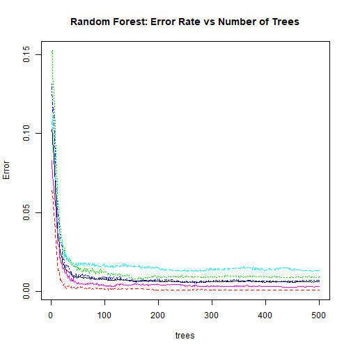

### 1.Overview

This analysis is the final report of the Peer Assessment project from Coursera's course Practical Machine Learning, as part of the Specialization in Data Science. 

This analysis meant to be the basis for the course quiz and a prediction assignment writeup. 

The main goal of the project is to predict the manner in which 6 participants performed some exercise as described below. 

There is the "classe" variable in the training set. 

The machine learning algorithm described here is applied to the 20 test cases available in the test data and the predictions are submitted in appropriate format to the Course Project Prediction Quiz for automated grading

### 2.Background Details

Using devices such as Jawbone Up, Nike FuelBand, and Fitbit it is now possible to collect a large amount of data about personal activity relatively inexpensively. These type of devices are part of the quantified self movement - a group of enthusiasts who take measurements about themselves regularly to improve their health, to find patterns in their behavior, or because they are tech geeks. One thing that people regularly do is quantify how much of a particular activity they do, but they rarely quantify how well they do it. In this project, your goal will be to use data from accelerometers on the belt, forearm, arm, and dumbell of 6 participants. They were asked to perform barbell lifts correctly and incorrectly in 5 different ways. More information is available from the website here: http://groupware.les.inf.puc-rio.br/har (see the section on the Weight Lifting Exercise Dataset).

Read more: http://groupware.les.inf.puc-rio.br/har#ixzz3xsbS5bVX

### 3.Data Loading and Exploratory Analysis

### 3.1 Overview of the Dataset

The training data for this project are available here:

https://d396qusza40orc.cloudfront.net/predmachlearn/pml-training.csv

The test data are available here:

https://d396qusza40orc.cloudfront.net/predmachlearn/pml-testing.csv

The data for this project come from http://groupware.les.inf.puc-rio.br/har. 

A short description of the datasets content from the authors' website:
  
"Six young health participants were asked to perform one set of 10 repetitions of the Unilateral Dumbbell Biceps Curl in five different fashions: exactly according to the specification (Class A), throwing the elbows to the front (Class B), lifting the dumbbell only halfway (Class C), lowering the dumbbell only halfway (Class D) and throwing the hips to the front (Class E).

Class A corresponds to the specified execution of the exercise, while the other 4 classes correspond to common mistakes. 
Participants were supervised by an experienced weight lifter to make sure the execution complied to the manner they were supposed to simulate. 
The exercises were performed by six male participants aged between 20-28 years, with little weight lifting experience. 
We made sure that all participants could easily simulate the mistakes in a safe and controlled manner by using a relatively light dumbbell (1.25kg)."

### 3.2 Setting up the environment for the analysis

```r
library(kernlab)
library(caret)
library(randomForest)
library(ggthemes)
library(gridExtra)
library(ggplot2)
library(grid)
library(e1071)
```

### 3.3 Load the data

The links for the training and test data are given below:

https://d396qusza40orc.cloudfront.net/predmachlearn/pml-training.csv

https://d396qusza40orc.cloudfront.net/predmachlearn/pml-testing.csv

First of all we fetch them and then load them:


```r
trainUrl <-"https://d396qusza40orc.cloudfront.net/predmachlearn/pml-training.csv"
testUrl <- "https://d396qusza40orc.cloudfront.net/predmachlearn/pml-testing.csv"
trainFile <- "./data/training.csv"
testFile  <- "./data/testing.csv"

if (!file.exists("./data")) {
  dir.create("./data")
}

if (!file.exists(trainFile)) {
    download.file(trainUrl, destfile = trainFile)
}
if (!file.exists(testFile)) {
    download.file(testUrl, destfile = testFile)
}

train <- read.csv(trainFile, na.strings=c("NA", "", "#DIV/0!"), stringsAsFactors=FALSE)
test <- read.csv(testFile, na.strings=c("NA", "", "#DIV/0!"), stringsAsFactors=FALSE)
train_used = train[,c(8:11,37:49,60:68,84:86,102,113:124,140,151:160)]
```

### 3.3.1 About the data set

The raw dataset contained 19622 rows of data, with 160160 variables. 

Many variables contained largely missing data (usually with only one row of data), so these were removed from the dataset. 

In addition, variables not concerning the movement sensors were also removed. 

This resulted in a dataset of 5353 variables.

### 3.3.3 Quality of the data set

Let us comment on the quality of the data in the below depicted graph


```r
gg1 = ggplot(data=train,aes(seq_along(roll_belt),roll_belt)) + geom_point(aes(colour=train$classe)) + labs(colour="Classe",title="Roll-Belt Measurement forall Participants",y="Roll Belt Measurement",x="Index")

gg2 = ggplot(data=train[train$user_name=="carlitos",],aes(seq_along(roll_belt),roll_belt)) + geom_point(aes(colour=train[train$user_name=="carlitos",]$classe)) + labs(colour="Classe",title="Roll Belt Measurement for Carlitos",y="Roll Belt Measurement",x="Index")

gg3 = ggplot(data=train[train$user_name=="charles",],aes(seq_along(roll_belt),roll_belt)) + geom_point(aes(colour=train[train$user_name=="charles",]$classe)) + labs(colour="Classe",title="Roll Belt Measurement for Charles",y="Roll Belt Measurement",x="Index")

grid.arrange(gg1, gg2, gg3,ncol=2)
```


### 3.4 Partitioning of data

The dataset will be partitioned into training and testing datasets, with 60% of the original data going to the training set and 40% to the testing set. 

The model was built with the training dataset, then tested on the testing dataset. The following code performs this procedure


```r
# partition training dataset into 60/40 training and test
train_part = createDataPartition(train_used$classe, p = 0.6, list = FALSE)
training = train_used[train_part, ]
testing = train_used[-train_part, ]
```

##  4.Selection of the model

### 4.1 Step-1

In the step-1 we will fit a decision tree to gain some intuition in the structure of the data. While easy to interpret, decision trees are known to be fairly poor predictors and we shall instead fit a random forest (an collection of decision trees).

Below we have fit a decision tree using the caret package. While we are already conducting cross-validation by splitting the training data into a training/validation subsets, the caret package allows us to easily conduct 10-fold cross validation in the model training call.


```r
set.seed(1234)
control = trainControl(method = "cv", number = 10)
modelFit2 = train(classe~., method = "rpart", data = training, trControl = control)
modelFit2
```

```
## CART 
## 
## 11776 samples
##    52 predictor
##     5 classes: 'A', 'B', 'C', 'D', 'E' 
## 
## No pre-processing
## Resampling: Cross-Validated (10 fold) 
## Summary of sample sizes: 10599, 10598, 10598, 10597, 10598, 10598, ... 
## Resampling results across tuning parameters:
## 
##   cp          Accuracy   Kappa     
##   0.03785002  0.5107884  0.36102963
##   0.06090808  0.4280575  0.22903443
##   0.11473659  0.3223387  0.05794787
## 
## Accuracy was used to select the optimal model using the largest value.
## The final value used for the model was cp = 0.03785002.
```

Despite a 10-fold cross validation process, the decision tree accurately predicts the training data only 51.6% of the time. While this is better than a purely random selection of the "classe" response, it's likely that we can find a model that predicts better.


```r
plot(modelFit2$finalModel, uniform = TRUE, main = "Classification Tree")
text(modelFit2$finalModel)
```


The initial node of the fitted decision tree splits on the roll belt feature to predict the E classe. We saw this relationship in our exploratory analysis. Also note that the D classe cannot be found at any of the terminal nodes so the fitted decision tree will never predict a D classe. Hopefully we can find a leaner that can do better than that!


```r
confusionMatrix(testing$classe,predict(modelFit2,newdata=testing))
```

```
## Confusion Matrix and Statistics
## 
##           Reference
## Prediction    A    B    C    D    E
##          A 2024   41  163    0    4
##          B  647  493  378    0    0
##          C  622   45  701    0    0
##          D  553  253  480    0    0
##          E  201  216  371    0  654
## 
## Overall Statistics
##                                           
##                Accuracy : 0.4935          
##                  95% CI : (0.4824, 0.5046)
##     No Information Rate : 0.5158          
##     P-Value [Acc > NIR] : 1               
##                                           
##                   Kappa : 0.3383          
##  Mcnemar's Test P-Value : NA              
## 
## Statistics by Class:
## 
##                      Class: A Class: B Class: C Class: D Class: E
## Sensitivity            0.5001  0.47042  0.33493       NA  0.99392
## Specificity            0.9452  0.84922  0.88406   0.8361  0.89037
## Pos Pred Value         0.9068  0.32477  0.51243       NA  0.45354
## Neg Pred Value         0.6397  0.91229  0.78512       NA  0.99938
## Prevalence             0.5158  0.13357  0.26676   0.0000  0.08386
## Detection Rate         0.2580  0.06283  0.08934   0.0000  0.08335
## Detection Prevalence   0.2845  0.19347  0.17436   0.1639  0.18379
## Balanced Accuracy      0.7227  0.65982  0.60949       NA  0.94215
```
### 4.2 Random Forest Method selection

The Random Forest method produces the best results. In addition, principal component analysis was attempted however this greatly reduced the prediction accuracy.

Cross validation is not used, as, according to the creators of the Random Forest algorithm: "In random forests, there is no need for cross-validation or a separate test set to get an unbiased estimate of the test set error." - Leo Breiman and Adele Cutler

The R code is shown below, as is the confusion matrix. The OOB error rate in the training and the confusion matrix is shown below. For informational purposes a plot of the error rate versus number of trees is also shown.


```r
set.seed(1777)
training$classe=as.factor(training$classe)
random_forest=randomForest(classe~.,data=training,ntree=500,importance=TRUE)
random_forest
```

```
## 
## Call:
##  randomForest(formula = classe ~ ., data = training, ntree = 500,      importance = TRUE) 
##                Type of random forest: classification
##                      Number of trees: 500
## No. of variables tried at each split: 7
## 
##         OOB estimate of  error rate: 0.62%
## Confusion matrix:
##      A    B    C    D    E class.error
## A 3344    4    0    0    0 0.001194743
## B   15 2258    6    0    0 0.009214568
## C    0   10 2039    5    0 0.007302824
## D    0    0   23 1904    3 0.013471503
## E    0    0    2    5 2158 0.003233256
```

### 4.2.1 Plot Random Forest:Error rate vs No of trees and get the randomforest tree


```r
plot(random_forest,main="Random Forest: Error Rate vs Number of Trees")
```



```r
#We suppress the tree since it is large output

#getTree(random_forest,1,labelVar=TRUE)
```

### 4.2.2 Variable Importance

It may be of interest to know which variables were most 'important' in the building of the model. 

This can be seen by plotting the mean decrease in accuracy and the mean decrease in the gini coefficient per variable. 

The more the accuracy of the random forest decreases due to the exclusion (or permutation) of a single variable, the more important that variable is deemed to be. 

The mean decrease in Gini coefficient is a measure of how each variable contributes to the homogeneity of the nodes and leaves in the resulting random forest. 

(from https://dinsdalelab.sdsu.edu/metag.stats/code/randomforest.html)


```r
impfile="./importance/imp.df.csv"
if (!file.exists("./importance")) {
  dir.create("./importance")
}
imp=importance(random_forest)
impL=imp[,c(6,7)]
imp.ma=as.matrix(impL)
imp.df=data.frame(imp.ma)

write.csv(imp.df, impfile, row.names=TRUE)
imp.df.csv=read.csv(impfile,header=TRUE)

colnames(imp.df.csv)=c("Variable","MeanDecreaseAccuracy","MeanDecreaseGini")
imp.sort =  imp.df.csv[order(-imp.df.csv$MeanDecreaseAccuracy),] 

imp.sort = transform(imp.df.csv, 
  Variable = reorder(Variable, MeanDecreaseAccuracy))

VIP=ggplot(data=imp.sort, aes(x=Variable, y=MeanDecreaseAccuracy)) + 
  ylab("Mean Decrease Accuracy")+xlab("")+
    geom_bar(stat="identity",fill="darkblue",alpha=.8,width=.75)+ 
    coord_flip()+theme_few() 

imp.sort.Gini <- transform(imp.df.csv, 
                      Variable = reorder(Variable, MeanDecreaseGini))

VIP.Gini=ggplot(data=imp.sort.Gini, aes(x=Variable, y=MeanDecreaseGini)) + 
  ylab("Mean Decrease Gini")+xlab("")+
  geom_bar(stat="identity",fill="darkred",alpha=.8,width=.75)+ 
  coord_flip()+theme_few() 

VarImpPlot=arrangeGrob(VIP, VIP.Gini,ncol=2)
grid.draw(VarImpPlot)
```


### 4.2.3 Model applied to test the data set


```r
test_predictions = predict(random_forest, newdata=testing)
confusionMatrix(test_predictions,testing$classe)
```

```
## Confusion Matrix and Statistics
## 
##           Reference
## Prediction    A    B    C    D    E
##          A 2231    8    0    0    0
##          B    1 1509   10    0    2
##          C    0    1 1358   19    0
##          D    0    0    0 1263    5
##          E    0    0    0    4 1435
## 
## Overall Statistics
##                                           
##                Accuracy : 0.9936          
##                  95% CI : (0.9916, 0.9953)
##     No Information Rate : 0.2845          
##     P-Value [Acc > NIR] : < 2.2e-16       
##                                           
##                   Kappa : 0.9919          
##  Mcnemar's Test P-Value : NA              
## 
## Statistics by Class:
## 
##                      Class: A Class: B Class: C Class: D Class: E
## Sensitivity            0.9996   0.9941   0.9927   0.9821   0.9951
## Specificity            0.9986   0.9979   0.9969   0.9992   0.9994
## Pos Pred Value         0.9964   0.9915   0.9855   0.9961   0.9972
## Neg Pred Value         0.9998   0.9986   0.9985   0.9965   0.9989
## Prevalence             0.2845   0.1935   0.1744   0.1639   0.1838
## Detection Rate         0.2843   0.1923   0.1731   0.1610   0.1829
## Detection Prevalence   0.2854   0.1940   0.1756   0.1616   0.1834
## Balanced Accuracy      0.9991   0.9960   0.9948   0.9907   0.9973
```

### 5 Inferences
The model was applied to the testing dataset and generated predictions for the class of weightlifting type. Above is the code that was used and the confusion matrix for the testing dataset. The accuracy is very high, at over 99%. The model accurately predicted all of the 20 test subjects.

### 6 Writing the test cases

```r
answers <- factor(predict(random_forest, test), labels = levels(training$classe))
answers <- as.character(answers)
answers
```

```
##  [1] "B" "A" "B" "A" "A" "E" "D" "B" "A" "A" "B" "C" "B" "A" "E" "E" "A"
## [18] "B" "B" "B"
```

```r
pml_write_files = function(x) {
  if (!file.exists("./answers")) {
  dir.create("./answers")
}
    n = length(x)
    for (i in 1:n) {
        filename = paste0("./answers/problem_id_", i, ".txt")
        write.table(x[i], file = filename, quote = FALSE, row.names = FALSE, 
            col.names = FALSE)
    }
}

pml_write_files(answers)
```

This ends the machine learning prediction exercise
